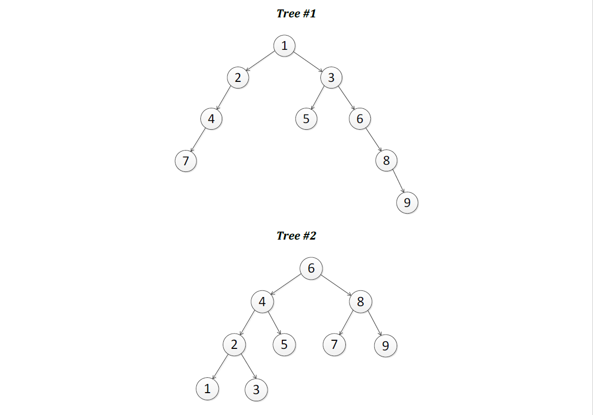
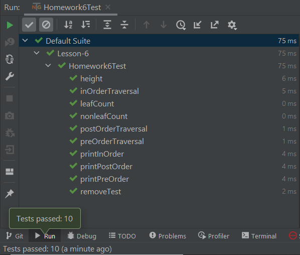
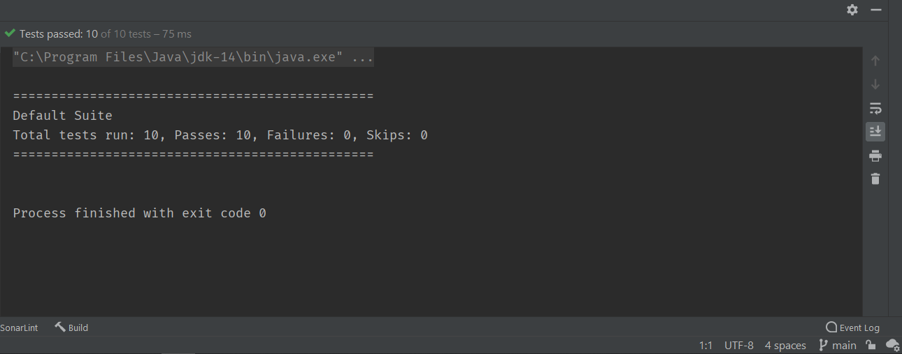

# Data Structures and Algorithms in Java (CSE-41321)
## University of California San Diego Extension
## Summer 2021 (157162)
## Raymond Mitchell III (Instructor)
## Assignment #6
### Binary Tree Algorithms
### Problem Statement
In this assignment,we were asked to implement a variety of methods that operate on binary trees, and to test those
methods using the following two trees:

We were required to implement seven methods and use the two trees illustrated above to demonstrate their functionality.
The seven methods were as follows:
* *public static int countLeaves(BinaryTree tree)*
    * Returns the number of leaf nodes in the tree.
* *public static int countNonLeaves(BinaryTree tree)*
    * Returns the number of non-leaf nodes in the tree.
* *public static int getHeight(BinaryTree tree)*
    * Returns the height of the tree.
* *public static void printPreOrder(BinaryTree tree)*
    * Returns the height of the tree.
* *public static void printInOrder(BinaryTree tree)*
    * Prints the elements of the tree using an in-order traversal.
* *public static void printPostOrder(BinaryTree tree)*
    * Prints the elements of the tree using a post-order traversal.
* *public static void removeLeaves(BinaryTree tree)*
    * Removes all leaf nodes from the tree.

### Implementation Plan
For this project I relied on several classes provided courtesy of the instructor. I *did* perform a modicum of unit
testing on methods in those classes, until I realized that probably wasn't the best use of my time. After all, I'm sure
they were subjected to rigorous testing by their author. In fact, I've _seen_ most of the test suites.

The classes I appropriated were as follows:

* BinaryTree
* Queue
* SinglyLinkedList
* TestVisitor
  * an implementation of the Visitor interface
* TreeAlgorithms

These classes did most of the heavy lifting, but I was responsible for implementing the seven methods described in the
*Problem Statement* section above. With each ensuing project, I try to make more use of TestNG framework. Although I
wouldn't describe them as extensive, this suite consists of 10 individual unit tests. Time constraints prevented me from
exploring that path as much as I might have liked.

### Implementation
#### Source Code
#### Homework6 class
```java
package cse41321.algorithms;

import java.util.NoSuchElementException;

public class Homework6 {
  /**
   * A generic BinaryTree class
   *
   * @param <E>
   */
  public static class BinaryTree<E> {
    /**
     * An inner class defining a Node type
     */
    public class Node {
      E data;
      Node left;
      Node right;

      // Only allow BinaryTree to create Nodes
      private Node(E data) {
        this.data = data;
      }

      public E getData() {
        return data;
      }

      public Node getLeft() {
        return left;
      }

      public Node getRight() {
        return right;
      }

      public boolean hasLeft() {
        return left != null;
      }

      public boolean hasRight() {
        return right != null;
      }

      public boolean isLeaf() {
        return !hasLeft() && !hasRight();
      }

      public Node insertLeft(E data) throws IllegalStateException {
        if (hasLeft()) {
          throw new IllegalStateException(
                  "Cannot insert because left child already exists");
        }

        left = new Node(data);
        ++size;

        return left;
      }

      public Node insertRight(E data) throws IllegalStateException {
        if (hasRight()) {
          throw new IllegalStateException(
                  "Cannot insert because right child already exists");
        }

        right = new Node(data);
        ++size;

        return right;
      }

      public E removeLeft() throws IllegalStateException {
        if (!hasLeft()) {
          throw new IllegalStateException(
                  "Cannot remove because left child does not exist");
        }
        if (!left.isLeaf()) {
          throw new IllegalStateException(
                  "Cannot remove because left child is not a leaf");
        }

        E data = left.data;
        left = null;
        --size;

        return data;
      }

      public E removeRight() throws IllegalStateException {
        if (!hasRight()) {
          throw new IllegalStateException(
                  "Cannot remove because right child does not exist");
        }
        if (!right.isLeaf()) {
          throw new IllegalStateException(
                  "Cannot remove because right child is not a leaf");
        }

        E data = right.data;
        right = null;
        --size;

        return data;
      }
    }   // End of Node class

    // Definition of the BinaryTree class continues here
    private int size;
    private Node root;

    public int getSize() {
      return size;
    }

    public boolean isEmpty() {
      return size == 0;
    }

    public Node getRoot() {
      return root;
    }

    public Node insertRoot(E data) throws IllegalStateException {
      if (!isEmpty()) {
        throw new IllegalStateException(
                "Cannot insert root into non-empty tree");
      }

      root = new Node(data);
      ++size;

      return root;
    }

    public E removeRoot() throws IllegalStateException {
      if (isEmpty()) {
        throw new IllegalStateException(
                "Cannot remove root of empty tree");
      }
      if (!root.isLeaf()) {
        throw new IllegalStateException(
                "Cannot remove because root is not a leaf");
      }

      E data = root.data;
      root = null;
      --size;

      return data;
    }

    public BinaryTree<E> merge(BinaryTree<E> other, E data) {
      BinaryTree<E> merged = new BinaryTree<E>();

      // Merge this and other into new tree with data as root
      merged.root = new Node(data);
      merged.root.left = this.root;
      merged.root.right = other.root;
      merged.size = 1 + this.size + other.size;

      // Remove all nodes from this and other
      this.root = null;
      this.size = 0;
      other.root = null;
      other.size = 0;

      return merged;
    }

  }   // BinaryTree class definition ends here

  /**
   * A generic SinglyLinkedList class
   */
  public static class SinglyLinkedList<E> {
    // An element in a linked list
    public class Element {
      private E data;
      private Element next;

      // Only allow SinglyLinkedList to construct Elements
      private Element(E data) {
        this.data = data;
        this.next = null;
      }

      public E getData() {
        return data;
      }

      public Element getNext() {
        return next;
      }

      private SinglyLinkedList getOwner() {
        return SinglyLinkedList.this;
      }
    }

    private Element head;
    private Element tail;
    private int size;

    public Element getHead() {
      return head;
    }

    public Element getTail() {
      return tail;
    }

    public int getSize() {
      return size;
    }

    public boolean isEmpty() {
      return size == 0;
    }

    public Element insertHead(E data) {
      Element newElement = new Element(data);

      if (isEmpty()) {
        // Insert into empty list
        head = newElement;
        tail = newElement;
      } else {
        // Insert into non-empty list
        newElement.next = head;
        head = newElement;
      }

      ++size;

      return newElement;
    }

    public Element insertTail(E data) {
      Element newElement = new Element(data);

      if (isEmpty()) {
        // Insert into empty list
        head = newElement;
        tail = newElement;
      } else {
        // Insert into non-empty list
        tail.next = newElement;
        tail = newElement;
      }

      ++size;

      return newElement;
    }

    public Element insertAfter(Element element, E data)
            throws IllegalArgumentException {
      // Check pre-conditions
      if (element == null) {
        throw new IllegalArgumentException(
                "Argument 'element' must not be null");
      }
      if (element.getOwner() != this) {
        throw new IllegalArgumentException(
                "Argument 'element' does not belong to this list");
      }

      // Insert new element
      Element newElement = new Element(data);
      if (tail == element) {
        // Insert new tail
        element.next = newElement;
        tail = newElement;
      } else {
        // Insert into middle of list
        newElement.next = element.next;
        element.next = newElement;
      }

      ++size;

      return newElement;
    }

    public E removeHead() throws NoSuchElementException {
      // Check pre-conditions
      if (isEmpty()) {
        throw new NoSuchElementException("Cannot remove from empty list");
      }

      // Remove the head
      Element oldHead = head;
      if (size == 1) {
        // Handle removal of the last element
        head = null;
        tail = null;
      } else {
        head = head.next;
      }

      --size;

      return oldHead.data;
    }

    // Note that there is no removeTail.  This cannot be implemented
    // efficiently because it would require O(n) to scan from head until
    // reaching the item _before_ tail.

    public E removeAfter(Element element)
            throws IllegalArgumentException, NoSuchElementException {
      // Check pre-conditions
      if (element == null) {
        throw new IllegalArgumentException(
                "Argument 'element' must not be null");
      }
      if (element.getOwner() != this) {
        throw new IllegalArgumentException(
                "Argument 'element' does not belong to this list");
      }
      if (element == tail) {
        throw new IllegalArgumentException(
                "Argument 'element' must have a non-null next element");
      }

      // Remove element
      Element elementToRemove = element.next;
      if (elementToRemove == tail) {
        // Remove the tail
        element.next = null;
        tail = element;
      } else {
        // Remove from middle of list
        element.next = elementToRemove.next;
      }

      --size;

      return elementToRemove.data;
    }

    @Override
    public boolean equals(Object o) {
      if (this == o) return true;
      if (o == null || getClass() != o.getClass()) return false;

      SinglyLinkedList<?> that = (SinglyLinkedList<?>) o;

      if (this.size != that.size) return false;

      // Return whether all elements are the same
      SinglyLinkedList<?>.Element thisElem = this.getHead();
      SinglyLinkedList<?>.Element thatElem = that.getHead();
      while (thisElem != null && thatElem != null) {
        if (!thisElem.getData().equals(thatElem.getData())) {
          return false;
        }
        thisElem = thisElem.getNext();
        thatElem = thatElem.getNext();
      }

      return true;
    }
  }   // The SinglyLinkedList class definition ends here

  /**
   * A generic Queue class
   *
   * @param <E>
   */
  public static class Queue<E> {
    private SinglyLinkedList<E> list = new SinglyLinkedList<E>();

    public void enqueue(E data) {
      list.insertTail(data);
    }

    public E dequeue() throws NoSuchElementException {
      if (isEmpty()) {
        throw new NoSuchElementException();
      }

      return list.removeHead();
    }

    public E peek() throws NoSuchElementException {
      if (isEmpty()) {
        throw new NoSuchElementException();
      }

      return list.getHead().getData();
    }

    public int getSize() {
      return list.getSize();
    }

    public boolean isEmpty() {
      return list.isEmpty();
    }
  }   // End of Queue class definition

  /**
   * Visitor interface
   */
  public interface Visitor<E> {
    void visit(E data);
  }   // End of Visitor interface definition

  /**
   * TreeAlgorithms class
   */
  public static final class TreeAlgorithms {
    // Pre-order traversal
    public static <E> void traversePreOrder(
            BinaryTree<E> tree,
            Visitor<E> visitor) {
      doTraversePreOrder(tree.getRoot(), visitor);
    }

    private static <E> void doTraversePreOrder(
            BinaryTree<E>.Node node,
            Visitor<E> visitor) {
      if (node == null) {
        return;
      }

      visitor.visit(node.getData());
      doTraversePreOrder(node.getLeft(), visitor);
      doTraversePreOrder(node.getRight(), visitor);
    }

    // In-order traversal
    public static <E> void traverseInOrder(
            BinaryTree<E> tree,
            Visitor<E> visitor) {
      doTraverseInOrder(tree.getRoot(), visitor);
    }

    private static <E> void doTraverseInOrder(
            BinaryTree<E>.Node node,
            Visitor<E> visitor) {
      if (node == null) {
        return;
      }

      doTraverseInOrder(node.getLeft(), visitor);
      visitor.visit(node.getData());
      doTraverseInOrder(node.getRight(), visitor);
    }

    // Post-order traversal
    public static <E> void traversePostOrder(
            BinaryTree<E> tree,
            Visitor<E> visitor) {
      doTraversePostOrder(tree.getRoot(), visitor);
    }

    private static <E> void doTraversePostOrder(
            BinaryTree<E>.Node node,
            Visitor<E> visitor) {
      if (node == null) {
        return;
      }

      doTraversePostOrder(node.getLeft(), visitor);
      doTraversePostOrder(node.getRight(), visitor);
      visitor.visit(node.getData());
    }

    // Level-order traversal
    public static <E> void traverseLevelOrder(
            BinaryTree<E> tree,
            Visitor<E> visitor) {
      // Queue holds nodes that have been discovered and must be visited
      Queue<BinaryTree<E>.Node> queue = new Queue<BinaryTree<E>.Node>();

      // Start off with only root in queue
      if (!tree.isEmpty()) {
        queue.enqueue(tree.getRoot());
      }

      // While nodes remain to be visited in the queue
      while (!queue.isEmpty()) {
        // Visit the front node
        BinaryTree<E>.Node node = queue.dequeue();
        visitor.visit(node.getData());

        // Enqueue front node's children
        if (node.hasLeft()) {
          queue.enqueue(node.getLeft());
        }
        if (node.hasRight()) {
          queue.enqueue(node.getRight());
        }
      }
    }
  }

  static class TestVisitor implements Visitor<Integer> {

    private SinglyLinkedList<Integer> visitedData = new SinglyLinkedList<Integer>();

    public SinglyLinkedList<Integer> getVisitedData() {
      return visitedData;
    }

    public void visit(Integer data) {
      visitedData.insertTail(data);
    }
  }

  public static int getLeafCount(BinaryTree<Integer>.Node node) {
    if (node == null) {
      return 0;
    }
    if (!node.hasLeft() && !node.hasRight()) {
      return 1;
    } else {
      return getLeafCount(node.getLeft()) + getLeafCount(node.getRight());
    }
  }

  public static BinaryTree<Integer>.Node deleteLeaves(BinaryTree<Integer>.Node node) {
    if (node == null) return null;
    if (!node.hasLeft() && !node.hasRight()) {
      node = null;
    } else {
      node = node.getLeft();
      node = deleteLeaves(node.getLeft());
      node = node.getRight();
      node = deleteLeaves(node.getRight());
    }
    return node;
  }

  public static int countLeaves(BinaryTree<Integer> tree) {
    return getLeafCount(tree.getRoot());
  }

  public static int countNonLeaves(BinaryTree<Integer> tree) {
    return tree.getSize() - getLeafCount(tree.getRoot());
  }

  public static int height(BinaryTree<Integer>.Node node) {
    if (node == null) return 0;
    return 1 + Math.max(height(node.getLeft()), height(node.getRight()));
  }

  public static int getHeight(BinaryTree<Integer> tree) {
    return height(tree.getRoot());
  }

  public static void printPreOrder(BinaryTree tree) {
    TestVisitor visitor = new TestVisitor();
    TreeAlgorithms.traversePreOrder(tree, visitor);
    SinglyLinkedList<Integer> singlyLinkedList = visitor.getVisitedData();
    SinglyLinkedList<Integer>.Element currentElement = singlyLinkedList.getHead();
    while (currentElement != null) {
      System.out.printf("%d ", currentElement.getData());
      currentElement = currentElement.getNext();
    }
  }

  public static void printInOrder(BinaryTree tree) {
    TestVisitor visitor = new TestVisitor();
    TreeAlgorithms.traverseInOrder(tree, visitor);
    SinglyLinkedList<Integer> singlyLinkedList = visitor.getVisitedData();
    SinglyLinkedList<Integer>.Element currentElement = singlyLinkedList.getHead();
    while (currentElement != null) {
      System.out.printf("%d ", currentElement.getData());
      currentElement = currentElement.getNext();
    }
  }

  public static void printPostOrder(BinaryTree tree) {
    TestVisitor visitor = new TestVisitor();
    TreeAlgorithms.traversePostOrder(tree, visitor);
    SinglyLinkedList<Integer> singlyLinkedList = visitor.getVisitedData();
    SinglyLinkedList<Integer>.Element currentElement = singlyLinkedList.getHead();
    while (currentElement != null) {
      System.out.printf("%d ", currentElement.getData());
      currentElement = currentElement.getNext();
    }

  }

  public static BinaryTree.Node leafDelete(BinaryTree.Node node) {
    // Delete leaf nodes from binary search tree.

    if (node == null) {
      return null;
    }
    if (node.left == null && node.right == null) {
      return null;
    }

    // Else recursively delete in left and right subtrees.
    node.left = leafDelete(node.left);
    node.right = leafDelete(node.right);

    return node;
  }

  public static void removeLeaves(BinaryTree tree) {
    BinaryTree.Node node = tree.getRoot();
    leafDelete(node);
  }
  
  public static class Driver {
    public static void main(String[] args) {
      Homework6.BinaryTree<Integer> firstTree;
      Homework6.BinaryTree<Integer> secondTree;
      Homework6.TestVisitor testVisitor;

      //   T H E   F I R S T   T R E E

      firstTree = new Homework6.BinaryTree<>();
      firstTree.insertRoot(1);
      firstTree.getRoot().insertLeft(2);
      firstTree.getRoot().getLeft().insertLeft(4);
      firstTree.getRoot().getLeft().getLeft().insertLeft(7);
      firstTree.getRoot().insertRight(3);
      firstTree.getRoot().getRight().insertLeft(5);
      firstTree.getRoot().getRight().insertRight(6);
      firstTree.getRoot().getRight().getRight().insertRight(8);
      firstTree.getRoot().getRight().getRight().getRight().insertRight(9);

      //   T H E   S E C O N D   T R E E

      secondTree = new Homework6.BinaryTree<>();
      secondTree.insertRoot(6);
      secondTree.getRoot().insertLeft(4);
      secondTree.getRoot().getLeft().insertLeft(2);
      secondTree.getRoot().getLeft().insertRight(5);
      secondTree.getRoot().getLeft().getLeft().insertLeft(1);
      secondTree.getRoot().getLeft().getLeft().insertRight(3);
      secondTree.getRoot().insertRight(8);
      secondTree.getRoot().getRight().insertLeft(7);
      secondTree.getRoot().getRight().insertRight(9);

      //   T H E   F I R S T   T R E E
      System.out.print("The pre-order traversal of tree #1: ");
      Homework6.printPreOrder(firstTree);
      System.out.println();
      System.out.print("The in-order traversal of tree #1: ");
      Homework6.printInOrder(firstTree);
      System.out.println();
      System.out.print("The post-order traversal of tree #1: ");
      Homework6.printPostOrder(firstTree);
      System.out.println();
      System.out.printf("The height of tree #1 is, %d%n", Homework6.getHeight(firstTree));
      System.out.printf("Tree #1 has %d leaves.%n", Homework6.countLeaves(firstTree));
      System.out.printf("There are %d \"non-leaves\" in tree #1.%n", Homework6.countNonLeaves(firstTree));
      Homework6.removeLeaves(firstTree);
      System.out.print("After removing the leaf nodes from tree #1: ");
      Homework6.printInOrder(firstTree);
      System.out.println();
      System.out.printf("The height of tree #1 after removing the leaf nodes is, %d%n",
              Homework6.getHeight(firstTree));

      //   T H E   S E C O N D   T R E E
      System.out.println();
      System.out.print("The pre-order traversal of tree #2: ");
      Homework6.printPreOrder(secondTree);
      System.out.println();
      System.out.print("The in-order traversal of tree #2: ");
      Homework6.printInOrder(secondTree);
      System.out.println();
      System.out.print("The post-order traversal of tree #2: ");
      Homework6.printPostOrder(secondTree);
      System.out.println();
      System.out.printf("The height of tree #2 is, %d%n", Homework6.getHeight(secondTree));
      System.out.printf("Tree #2 has %d leaves.%n", Homework6.countLeaves(secondTree));
      System.out.printf("There are %d \"non-leaves\" in tree #2.%n", Homework6.countNonLeaves(secondTree));
      Homework6.removeLeaves(secondTree);
      System.out.print("After removing the leaf nodes from tree #2: ");
      Homework6.printInOrder(secondTree);
      System.out.println();
      System.out.printf("The height of tree #2 after removing the leaf nodes is, %d%n",
              Homework6.getHeight(secondTree));
    }
  }
}

```
#### Homework6Test class
```java
package cse41321.algorithms;

import org.testng.annotations.Test;

import java.io.ByteArrayOutputStream;
import java.io.PrintStream;

import static org.testng.Assert.*;

public class Homework6Test {

    private final PrintStream originalStdOut = System.out;
    private ByteArrayOutputStream consoleContent = new ByteArrayOutputStream();

    private Homework6.BinaryTree<Integer> firstTree;
    private Homework6.BinaryTree<Integer> secondTree;
    private Homework6.TestVisitor testVisitor;

    @org.testng.annotations.BeforeMethod
    public void setUp() {
        /*
            T H E   F I R S T   T R E E

                        (1)
                       /   \
                     (2)   (3)
                    /     /   \
                  (4)    (5)  (6)
                 /               \
               (7)               (8)
                                    \
                                    (9)
         */
        firstTree = new Homework6.BinaryTree<>();
        firstTree.insertRoot(1);
        firstTree.getRoot().insertLeft(2);
        firstTree.getRoot().getLeft().insertLeft(4);
        firstTree.getRoot().getLeft().getLeft().insertLeft(7);
        firstTree.getRoot().insertRight(3);
        firstTree.getRoot().getRight().insertLeft(5);
        firstTree.getRoot().getRight().insertRight(6);
        firstTree.getRoot().getRight().getRight().insertRight(8);
        firstTree.getRoot().getRight().getRight().getRight().insertRight(9);
        /*
                    T H E   S E C O N D   T R E E

                               (6)
                              /   \
                             /     \
                          (4)       (8)
                         /   \     /   \
                       (2)   (5) (7)   (9)
                      /   \
                     /     \
                   (1)     (3)
         */
        secondTree = new Homework6.BinaryTree<>();
        secondTree.insertRoot(6);
        secondTree.getRoot().insertLeft(4);
        secondTree.getRoot().getLeft().insertLeft(2);
        secondTree.getRoot().getLeft().insertRight(5);
        secondTree.getRoot().getLeft().getLeft().insertLeft(1);
        secondTree.getRoot().getLeft().getLeft().insertRight(3);
        secondTree.getRoot().insertRight(8);
        secondTree.getRoot().getRight().insertLeft(7);
        secondTree.getRoot().getRight().insertRight(9);

        testVisitor = new Homework6.TestVisitor();

        // Redirect all System.out to consoleContent.
        System.setOut(new PrintStream(this.consoleContent));
    }

    @org.testng.annotations.AfterMethod
    public void tearDown() {
        System.setOut(this.originalStdOut);     // Restore original standard out
        // Clear the consoleContent.
        this.consoleContent = new ByteArrayOutputStream();
    }

    @Test
    public void inOrderTraversal() {
        Homework6.SinglyLinkedList<Integer> expectedResult = new Homework6.SinglyLinkedList<>();
        expectedResult.insertTail(7);
        expectedResult.insertTail(4);
        expectedResult.insertTail(2);
        expectedResult.insertTail(1);
        expectedResult.insertTail(5);
        expectedResult.insertTail(3);
        expectedResult.insertTail(6);
        expectedResult.insertTail(8);
        expectedResult.insertTail(9);

        Homework6.TreeAlgorithms.traverseInOrder(firstTree, testVisitor);

        assertEquals(testVisitor.getVisitedData(), expectedResult);

        expectedResult = new Homework6.SinglyLinkedList<>();
        expectedResult.insertTail(1);
        expectedResult.insertTail(2);
        expectedResult.insertTail(3);
        expectedResult.insertTail(4);
        expectedResult.insertTail(5);
        expectedResult.insertTail(6);
        expectedResult.insertTail(7);
        expectedResult.insertTail(8);
        expectedResult.insertTail(9);

        testVisitor = new Homework6.TestVisitor();

        Homework6.TreeAlgorithms.traverseInOrder(secondTree, testVisitor);

        assertEquals(testVisitor.getVisitedData(), expectedResult);
    }

    @Test
    public void preOrderTraversal() {
        Homework6.SinglyLinkedList<Integer> expectedResult = new Homework6.SinglyLinkedList<>();
        expectedResult.insertTail(1);
        expectedResult.insertTail(2);
        expectedResult.insertTail(4);
        expectedResult.insertTail(7);
        expectedResult.insertTail(3);
        expectedResult.insertTail(5);
        expectedResult.insertTail(6);
        expectedResult.insertTail(8);
        expectedResult.insertTail(9);

        Homework6.TreeAlgorithms.traversePreOrder(firstTree, testVisitor);

        assertEquals(testVisitor.getVisitedData(), expectedResult);

        expectedResult = new Homework6.SinglyLinkedList<>();
        expectedResult.insertTail(6);
        expectedResult.insertTail(4);
        expectedResult.insertTail(2);
        expectedResult.insertTail(1);
        expectedResult.insertTail(3);
        expectedResult.insertTail(5);
        expectedResult.insertTail(8);
        expectedResult.insertTail(7);
        expectedResult.insertTail(9);

        testVisitor = new Homework6.TestVisitor();

        Homework6.TreeAlgorithms.traversePreOrder(secondTree, testVisitor);

        assertEquals(testVisitor.getVisitedData(), expectedResult);
    }

    @Test
    public void postOrderTraversal() {
        Homework6.SinglyLinkedList<Integer> expectedResult = new Homework6.SinglyLinkedList<>();
        expectedResult.insertTail(7);
        expectedResult.insertTail(4);
        expectedResult.insertTail(2);
        expectedResult.insertTail(5);
        expectedResult.insertTail(9);
        expectedResult.insertTail(8);
        expectedResult.insertTail(6);
        expectedResult.insertTail(3);
        expectedResult.insertTail(1);

        Homework6.TreeAlgorithms.traversePostOrder(firstTree, testVisitor);

        assertEquals(testVisitor.getVisitedData(), expectedResult);

        expectedResult = new Homework6.SinglyLinkedList<>();
        expectedResult.insertTail(1);
        expectedResult.insertTail(3);
        expectedResult.insertTail(2);
        expectedResult.insertTail(5);
        expectedResult.insertTail(4);
        expectedResult.insertTail(7);
        expectedResult.insertTail(9);
        expectedResult.insertTail(8);
        expectedResult.insertTail(6);

        testVisitor = new Homework6.TestVisitor();

        Homework6.TreeAlgorithms.traversePostOrder(secondTree, testVisitor);

        assertEquals(testVisitor.getVisitedData(), expectedResult);
    }

    @Test
    public void leafCount() {
        assertEquals(Homework6.countLeaves(firstTree), 3);
        assertEquals(Homework6.countLeaves(secondTree), 5);
    }

    @Test
    public void nonleafCount() {
        assertEquals(Homework6.countNonLeaves(firstTree), 6);
        assertEquals(Homework6.countNonLeaves(secondTree), 4);
    }

    @Test
    public void height() {
        assertEquals(Homework6.getHeight(firstTree), 5);
        assertEquals(Homework6.getHeight(secondTree), 4);
    }

    @Test
    public void printPreOrder() {
        Homework6.printPreOrder(firstTree);
        assertTrue(this.consoleContent.toString().contains("1 2 4 7 3 5 6 8 9"));
        Homework6.printPreOrder(secondTree);
        assertTrue(this.consoleContent.toString().contains("6 4 2 1 3 5 8 7 9"));
    }

    @Test
    public void printInOrder() {
        Homework6.printInOrder(firstTree);
        assertTrue(this.consoleContent.toString().contains("7 4 2 1 5 3 6 8 9"));
        Homework6.printInOrder(secondTree);
        assertTrue(this.consoleContent.toString().contains("1 2 3 4 5 6 7 8 9"));
    }

    @Test
    public void printPostOrder() {
        Homework6.printPostOrder(firstTree);
        assertTrue(this.consoleContent.toString().contains("7 4 2 5 9 8 6 3 1"));
        Homework6.printPostOrder(secondTree);
        assertTrue(this.consoleContent.toString().contains("1 3 2 5 4 7 9 8 6"));
    }

    @Test
    public void removeTest() {
        Homework6.removeLeaves(firstTree);
        Homework6.printInOrder(firstTree);
        assertTrue(this.consoleContent.toString().contains("4 2 1 3 6 8"));
        Homework6.removeLeaves(secondTree);
        Homework6.printInOrder(secondTree);
        assertTrue(this.consoleContent.toString().contains("2 4 6 8"));
    }

}
```
### Results
#### Unit Test Results


#### Integration Test Results
```text

The pre-order traversal of tree #1: 1 2 4 7 3 5 6 8 9 
The in-order traversal of tree #1: 7 4 2 1 5 3 6 8 9 
The post-order traversal of tree #1: 7 4 2 5 9 8 6 3 1 
The height of tree #1 is, 5
Tree #1 has 3 leaves.
There are 6 "non-leaves" in tree #1.
After removing the leaf nodes from tree #1: 4 2 1 3 6 8 
The height of tree #1 after removing the leaf nodes is, 4

The pre-order traversal of tree #2: 6 4 2 1 3 5 8 7 9 
The in-order traversal of tree #2: 1 2 3 4 5 6 7 8 9 
The post-order traversal of tree #2: 1 3 2 5 4 7 9 8 6 
The height of tree #2 is, 4
Tree #2 has 5 leaves.
There are 4 "non-leaves" in tree #2.
After removing the leaf nodes from tree #2: 2 4 6 8 
The height of tree #2 after removing the leaf nodes is, 3

Process finished with exit code 0

```
### Postmortem
The first unit test of the in-order method failed on the second tree. When I discovered that I had inadvertently omitted
a couple of nodes/leaves, I thought I had found the remedy. However, the test continued to fail! Eventually I 
discovered that, because I was testing both trees in a single test method, I needed a fresh (new) "Visitor" each time.
So, I ensured that before each call to the in-order method, I instantiated a new Visitor object.

The success of the unit test of the in-order method was probably sufficient to confirm that trees had been constructed
correctly. Besides, I was reusing code that had already been rigorously tested. Regardless, I implemented a couple of
additional tests, just to be thorough.

Considering that I was reusing code that was likely already rigorously tested, I wasted a lot of time on those unit 
tests.

This is an example of why programming is so tedious. There was a statement in the code being flagged by the editor
because a command was misspelled! The thing that made it so insidious was that the misspelling actually represented a
legitimate command. It was only the argument list that differentiated the command I wanted from the command I had typed.
So, it wasn't immediately apparent to me why the editor was flagging the statement. Fortunately, it only took a few 
moments for me to figure it out. _Unfortunately_, that is not always the case. Sometimes it can take hours to find an
error caused by single misplaced character in the source code.

To avert a disaster, I push the project repository to GitHub frequently.

The test suite is not very robust, but I soon realized that I could spend forever refining the test suite, and never get
around to anything else.

I spent the majority of my time trying to get the _removeLeaves()_ method to work, only to find out that the unit test's
method call was flawed. Specifically, I had placed arguments in the parameter list which, to the best of my knowledge,
isn't expecting any. I have no idea how long the _removeLeaves()_ method might have been working correctly before I
discovered the root cause. All I can say is that I toiled for at least a couple of hours.

As of 4:51 on the morning of August 4, all of the coding is done.

It is 7:56 in the morning on August 4. There is probably a lot more I'd like to say, but I'm going to close the book on
this one. As usual, this was quite the learning experience. I try to get as much out of each assignment as I can, time
permitting.